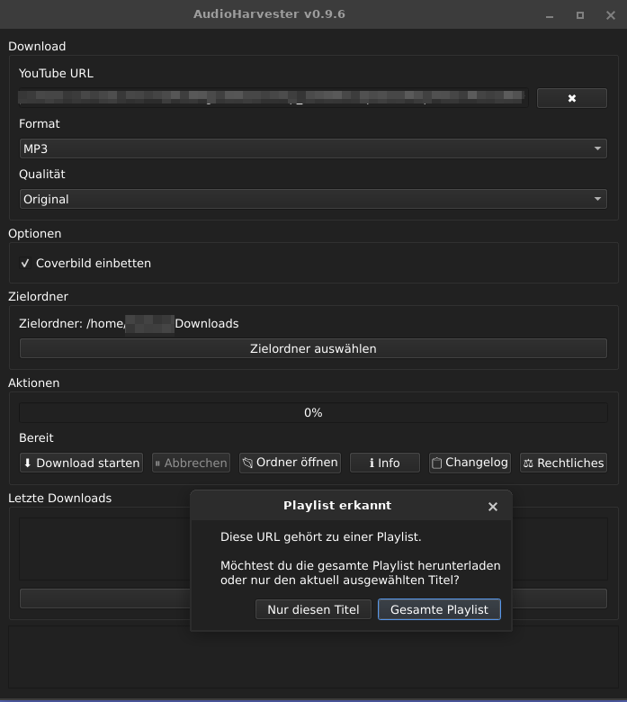

<p align="center">
  
</p>

<h1 align="center">AudioHarvester</h1>
<p align="center">
  A lightweight Linux audio downloader powered by yt-dlp and ffmpeg.
</p>

## Features

* MP3, Opus and M4A support
* Audio quality selection
* Embedded cover artwork
* Metadata support
* Playlist downloads
* Download entire playlists or a single track
* Download cancellation
* Download history
* History management
* Custom output directory
* Saved settings
* XFCE menu integration
* Installable DEB package
* Automatic yt-dlp detection
* Integrated changelog viewer
* Modular application architecture

## Screenshots

### Main Window





### About Dialog


### Legal Notice


## Requirements

* Python 3.10+
* PyQt6
* Python-Markdown
* yt-dlp (pipx installation recommended)
* ffmpeg

## Installation

### Option 1: Install the DEB Package

Download the latest `.deb` package from the GitHub Releases page.

```bash
sudo apt install ./audioharvester_0.9.6_all.deb
```

Start the application from your desktop menu or by running:

```bash
audioharvester
```

### Uninstall

Remove AudioHarvester:

```bash
sudo apt remove audioharvester
```

Remove AudioHarvester including configuration:

```bash
sudo apt purge audioharvester
```

User settings are stored in:

```text
~/.config/audioharvester/
```

and can be removed manually if desired.

### Option 2: Run from Source

Clone the repository:

```bash
git clone https://github.com/wildcardcharacter/AudioHarvester.git
cd AudioHarvester
```

Install the required Python package:

```bash
pip install PyQt6 markdown
```

Install yt-dlp (recommended):

```bash
pipx install yt-dlp
```

Verify the installation:

```bash
which yt-dlp
yt-dlp --version
```

Install ffmpeg using your distribution's package manager.

## Run

```bash
python3 src/main.py
```

## Changelog Viewer

AudioHarvester includes an integrated changelog viewer.

The application reads the project's `CHANGELOG.md` file and renders it as formatted Markdown directly inside the application.

## Notes

AudioHarvester automatically prefers a user-installed **pipx** version of **yt-dlp** and falls back to a system-wide installation if no local installation is available.

The graphical user interface is currently available in **German only**.

English language support is planned for a future release.

## Legal Notice

AudioHarvester is intended for downloading content that you are legally allowed to access and store.

Users are responsible for complying with local laws, copyright regulations and the terms of service of the platforms they use.

## Version

Current release: **v0.9.6**

## Author

Markus

Website:

https://wildcardcharacter.github.io

Support the project:

https://buymeacoffee.com/wildcardcharacter

## License

MIT License
