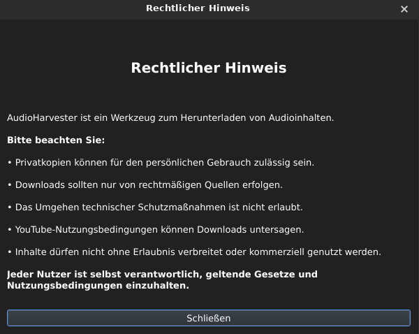

# AudioHarvester

AudioHarvester is a lightweight Linux desktop application for downloading audio from YouTube using **yt-dlp** and **ffmpeg**.

Built with **Python** and **PyQt6**.

## Features

* MP3, Opus and M4A support
* Audio quality selection
* Embedded cover artwork
* Metadata support
* Playlist downloads
* Download entire playlists or a single track
* Download cancellation
* Download history
* History management
* Custom output directory
* Saved settings
* XFCE menu integration

## Screenshots

### Main Window


### Legal Notice



### About Dialog


## Requirements

* Python 3.10+
* PyQt6
* yt-dlp
* ffmpeg

## Installation

### Option 1: Install the DEB package

Download the latest `.deb` package from the GitHub Releases page.

Install it with:

```bash
sudo apt install ./audioharvester_0.9_all.deb
```

After installation, AudioHarvester can be started from the application menu or with:

```bash
audioharvester
```

### Uninstall

To remove AudioHarvester:

```bash
sudo apt remove audioharvester
```

To remove the package including system-wide configuration files:

```bash
sudo apt purge audioharvester
```

User settings are stored in:

```text
~/.config/audioharvester/
```

and can be removed manually if desired.

### Option 2: Run from source

Clone the repository:

```bash
git clone https://github.com/wildcardcharacter/AudioHarvester.git
cd AudioHarvester
```

Install dependencies:

```bash
pip install PyQt6
```

Install yt-dlp:

```bash
pipx install yt-dlp
```

or

```bash
pip install -U yt-dlp
```

Install ffmpeg using your distribution's package manager.

### Notes

AudioHarvester currently expects yt-dlp to be available at:

```bash
~/.local/bin/yt-dlp
```

This is the default location when yt-dlp is installed via pipx.

## Run

```bash
python3 src/main.py
```

## Legal Notice

AudioHarvester is intended for downloading content that you are legally allowed to access and store.

Users are responsible for complying with local laws, copyright regulations, and the terms of service of the platforms they use.

## Version

Current release: **v0.9**

## Author

Markus 

Website:
https://wildcardcharacter.github.io

Support development:
https://buymeacoffee.com/wildcardcharacter

## License

MIT License
