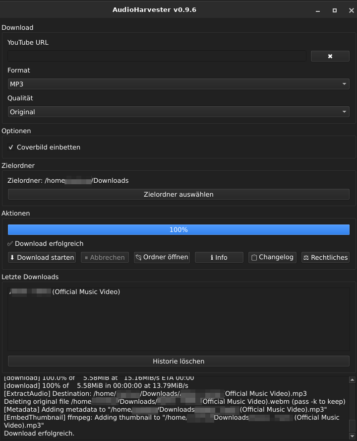

# AudioHarvester

<p align="center">
  
</p>

<h1 align="center">AudioHarvester</h1>

<p align="center">
  <strong>A modern Linux audio downloader powered by yt-dlp, ffmpeg and PyQt6.</strong>
</p>

<p align="center">
  
  
  
  
  
  
  
  
</p>

<p align="center">
  YouTube • Audio • MP3 • Opus • M4A • Open Source • Debian • XFCE
</p>

---

## 📸 Preview

<p align="center">
  
</p>

---

## ✨ Features

* 🎵 Download audio from YouTube
* 🎧 MP3, Opus and M4A support
* 🎚 Audio quality selection
* 🖼 Embed cover artwork
* 📝 Automatic metadata support
* 📃 Download complete playlists
* 🎯 Download only the selected track from playlists
* ⏹ Cancel running downloads
* 📜 Download history
* 🗂 History management
* 📁 Custom output directory
* ⚙ Saved settings
* 📖 Integrated changelog viewer
* ⚖ Integrated legal information
* 🔍 Automatic yt-dlp detection
* 📦 Installable Debian package
* 🖥 XFCE application menu integration
* 🧩 Modular project architecture

---

## 🖼 Screenshots

### Main Window

<p align="center">
  
</p>

### Playlist Detection

<p align="center">
  
</p>

### About Dialog

<p align="center">
  
</p>

### Legal Notice

<p align="center">
  
</p>

---

## 📦 Installation

### Debian Package

Download the latest release from the GitHub Releases page.

```bash
sudo apt install ./audioharvester_0.9.6_all.deb
```

Start AudioHarvester:

```bash
audioharvester
```

---

## 🚀 Run from Source

Clone the repository:

```bash
git clone https://github.com/wildcardcharacter/AudioHarvester.git
cd AudioHarvester
```

Install the required dependencies:

```bash
pip install PyQt6 markdown
```

Install **yt-dlp** (recommended):

```bash
pipx install yt-dlp
```

Verify the installation:

```bash
which yt-dlp
yt-dlp --version
```

Install **ffmpeg** using your distribution's package manager.

Run the application:

```bash
python3 src/main.py
```

---

## ⚙ Requirements

* Linux
* Python 3.10 or newer
* PyQt6
* Python-Markdown
* yt-dlp
* ffmpeg

---

## 📖 Changelog

All changes are documented in **CHANGELOG.md**.

AudioHarvester also includes an integrated Markdown-based changelog viewer.

---

## 🗺 Roadmap

Planned features:

* 🌍 English user interface
* 📦 AppImage package
* 📦 Flatpak package
* 🚀 Flathub release
* 🤖 GitHub Actions build workflow
* 🎨 Theme improvements
* 🔊 Additional audio formats

See **TODO.md** for the complete roadmap.

---

## 🤝 Contributing

Bug reports, feature requests and pull requests are always welcome.

If you find a bug or have an idea for a new feature, feel free to open an issue.

---

## 📄 License

This project is licensed under the MIT License.

See **LICENSE.txt** for more information.

---

## 👤 Author

**Markus**

🌐 Website
https://wildcardcharacter.github.io

💻 GitHub
https://github.com/wildcardcharacter

☕ Support the project
https://buymeacoffee.com/wildcardcharacter
