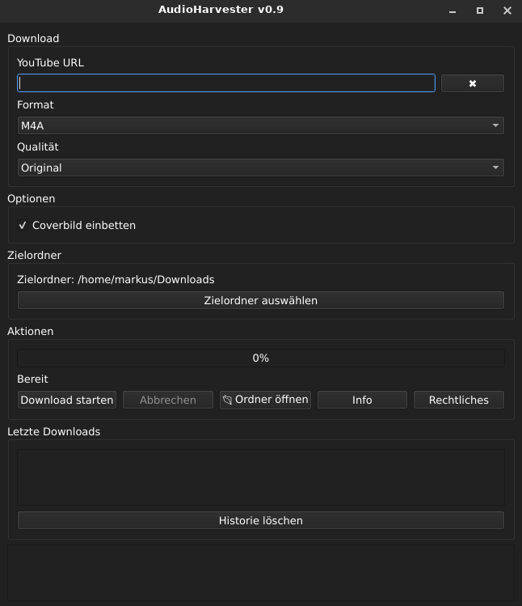
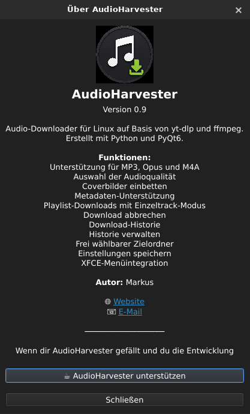

# AudioHarvester

AudioHarvester is a lightweight Linux desktop application for downloading audio from YouTube using **yt-dlp** and **ffmpeg**.

Built with **Python** and **PyQt6**.

## Features

* MP3, Opus and M4A support
* Audio quality selection
* Embedded cover artwork
* Metadata support
* Playlist downloads
* Download entire playlists or a single track
* Download cancellation
* Download history
* History management
* Custom output directory
* Saved settings
* XFCE menu integration

## Screenshots

### Main Window



### Legal notice

![Playlist Detection](screenshots/egal-dialog.png

### About Dialog



## Requirements

* Python 3.10+
* PyQt6
* yt-dlp
* ffmpeg

## Installation

Clone the repository:

```bash
git clone https://github.com/wildcardcharacter/AudioHarvester.git
cd AudioHarvester
```

Install dependencies:

```bash
pip install PyQt6
```

Install yt-dlp:

```bash
pip install -U yt-dlp
```

Install ffmpeg using your distribution's package manager.

## Run

```bash
python3 src/main.py
```

## Legal Notice

AudioHarvester is intended for downloading content that you are legally allowed to access and store.

Users are responsible for complying with local laws, copyright regulations, and the terms of service of the platforms they use.

## Version

Current release: **v0.9**

## Author

Markus Reichelt

Website:
https://wildcardcharacter.github.io

Support development:
https://buymeacoffee.com/wildcardcharacter
